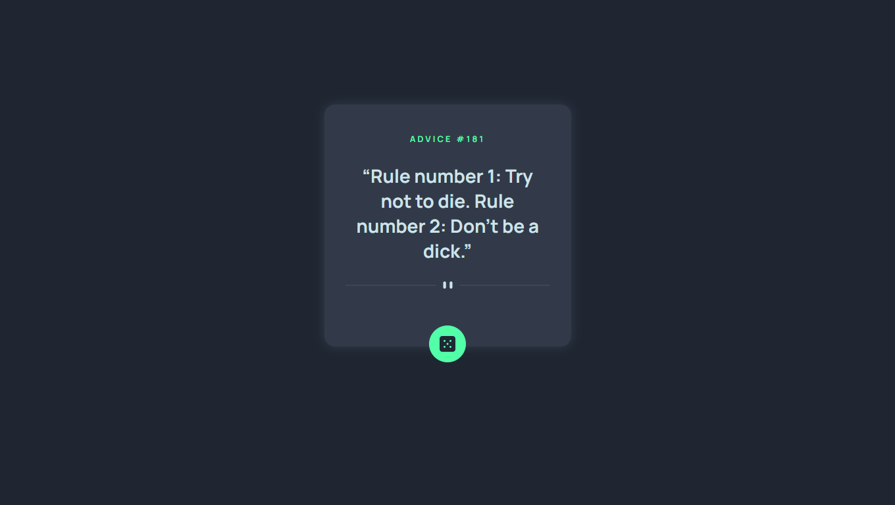

# Frontend Mentor - Advice generator app

## Welcome! 👋

Hello! This is my solution to the Advice Generator challenge on [Frontend Mentor](https://www.frontendmentor.io). Try it out here at the [live site](https://klrfl.github.io/advice-generator).

## The challenge

This is an advice generator app. I fetched the advice using the [Advice Slip API](https://api.adviceslip.com).

You should be able to:

- View the optimal layout for the app depending on their device's screen size
- See hover states for all interactive elements on the page
- Generate a new piece of advice by clicking the dice icon
